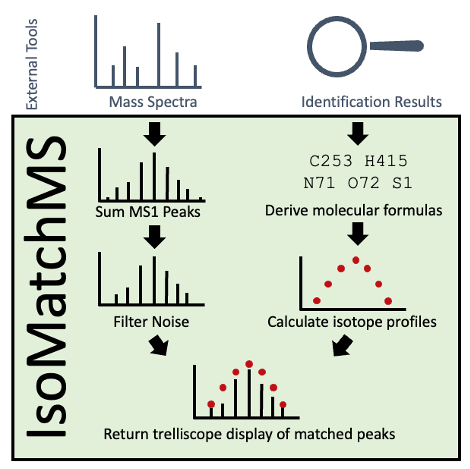

# IsoMatchMS

R package for matching and visualizing isotope profiles with trelliscope displays.
This package includes support for:

\

* Intact proteomics 

* Proteoforms (those with known post-translational modifications and unknown mass shifts) 

* Digested proteomics 

* Glycomics (using molecular formula)

* Adducts of different masses

* Any biomolecules with a known molecular formula (lipids, metabolites, etc.)

\
\
\

# How it works

1. All MS1 peaks from an MS data file (XML-based or ThermoFisher raw) are summed together.
Alternatively, a pre-summed spectra can be used. 

2. The summed spectra is noise filtered, with recommended values provided for 
top-down proteomics, bottom-up proteomics, and small molecules (glycomics).

3. Isotope profiles are calculated based the on provided molecular formulas (small molecule
identification) or ProForma strings (proteomics). These ProForma strings can include
any modifications, either known (e.g. Acetyl, Oxidation), or unknown (e.g. a numeric
mass shift).

4. The isotope profiles are matched to the mass spectra,
ranked from high to low quality with Pearson correlation. Results are visualized with 
an interactive trelliscope display.

\
\
\
\

# To install 

`devtools::install_github("PNNL-HubMAP-Proteoform-Suite/IsoMatchMS")`

To get started, read our [vignette](https://pnnl-hubmap-proteoform-suite.github.io/IsoMatchMS/) 

## Example displays

Example trelliscope displays can be seen [here](https://pnnl-hubmap-proteoform-suite.github.io/IsoMatchMS_Trelliscope_Examples/)

If some panels do not load through github.io, try git cloning the example repo, clicking the docs folder, selecting the display you'd like to open, and then clicking the index.html file. 

Here is the command to copy the example repo: 

`git clone https://github.com/PNNL-HubMAP-Proteoform-Suite/IsoMatchMS_Trelliscope_Examples.git`

# Test function coverage

85.6%
