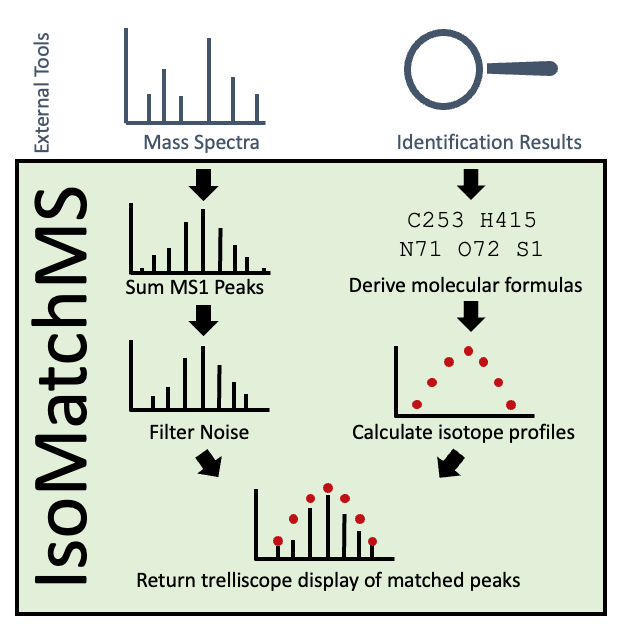

```{r, include = FALSE}
knitr::opts_chunk$set(
  collapse = TRUE,
  comment = "#>"
)
```

```{r setup, messages = F, warnings = FALSE}
suppressWarnings({
  library(ProteoMatch)
  library(pspectorlib)
  library(ggplot2)
})
```

# What is ProteoMatch

ProteoMatch is a package designed to match proteoforms to MS1 spectra, allowing for
researchers to identify the proteins in their data. The output is then shown to the
user through a trelliscope display, which allows for easy sorting and comparison
of the matches found in the data. 



This package draws heavily from the pspector package. pspectorlib has various support 
for MS proteomics in R, including making peak_data objectsMore information about that 
package can be found [here](https://github.com/EMSL-Computing/pspectorlib).

# Wrapper Function - run_proteomatch()

The ProteoMatch pipeline can be run with a single wrapper function, `run_proteomatch()`.
The function requires a vector containing either proforma strings or molecular formulas 
of the proteins you wish to match, a Settings File specifying the run's parameters in 
the form of an .xlsx, and finally a pspectorlib peak_data object. 

More examples can be found below. Both of these datasets can be
found in the `ProteoMatch/inst/extdata` directory.

## Intact Proteins Example

The following shows an example use of the `run_proteomatch()` function containing
intact protein test data (also known as top-down proteomics). These proteins are 
considered intact since they have not been digested, or only very lightly digested. 

Below, the .csv containing protein information is loaded in, along with the pre-made 
pspectorlib peak_data object. Further instructions on how to make this can be found 
in Section 2.3. 

```{r, eval=FALSE}
#reading in test data
Protein_data <- read.csv("../inst/extdata/Intact_Proteins_List_Short.csv", sep = "\t")
peak_data <- readRDS("../inst/extdata/Intact_PeakData.RDS")

#running proteomatch wrapper function
run_proteomatch(
    Modifications = Protein_data$Formula,
    ModType = "Proforma",
    SummedSpectra = peak_data,
    SettingsFile = "../inst/extdata/Intact_Protein_Defaults.xlsx",
    Proteins = Protein_data$Protein
    )
```

## Peptides Example

The following shows an example use of the `run_proteomatch()` function containing 
peptides test data (also known as bottom-up proteomics) This data is considered peptide 
data since it has beenheavily digested, and only contains proteins of a relitivly 
small size.

Below, the .tsv containing protein information is loaded in, along with the pre-made 
pspectorlib peak_data object. Further instructions on how to make this can be found 
in Section 2.3. 

```{r, eval=FALSE}
Protein_data <- read.csv("../inst/extdata/Peptides_List_Short.csv")
peak_data <- readRDS("../inst/extdata/Peptides_PeakData.RDS")

run_proteomatch(Modifications = Protein_data$Proteoform,
    ModType = "ProForma",
    SummedSpectra = peak_data,
    SettingsFile = "../inst/extdata/Peptides_Defaults.xlsx.xlsx",
    Proteins = Protein_data$Protein
    )
```

# Detailed Major Steps

The ProteoMatch packages offers stand-alone functions, so users can have a greater
control over the processing of their data.

## Settings File Parameters

The ProteoMatch package requires a "Settings" file in the format of on .xlsx. Some examples
of this format are provided `inst/extdata` directory. The example files show the required
parameters, suggestions for how often they will need to be changed between runs, and 
a decription of the parameter. We'll take a look at the example here.

```{r}
SettingsFile <- readxl::read_excel("../inst/extdata/Intact_Protein_Defaults.xlsx")
knitr::kable(SettingsFile)
```


## Summing MS1 Spectra

ProteoMatch has the ability to sum the spectra contained in the .mzML file before 
running the analysis. This can be achieved using the `sum_ms1_spectra()` 
function. Here an example is shwon with test data built in to the pspector package.

```{r, eval=FALSE}
# Create a temporary directory and copy example data there
tmpdir <- tempdir()

#Downloading test data
file <- "https://raw.githubusercontent.com/EMSL-Computing/pspector/master/pspector_container/TestFiles/BottomUp/BottomUp.mzML"
download.file(file, file.path(tmpdir, tail(unlist(strsplit(file, "/")), 1)))

#Summing the spectra
SummedSpec <- sum_ms1_spectra(mzMLPath = "../inst/extdata/BottomUp.mzML", MinimumAbundance = 0.01)
```

## Creating a Peak_Data Object

Once the optional step of summing the spectra has been completed, the psectorlib
package can be used to create a peak_data object. This can be done with a .mzML file or 
with two vectors with MZ and Intensity values.

This is an example of reading in a summed mzML file. First, a scan_metadata object is created 
using the `pspectorlib::get_scan_metadata` function. That output is then used in the 
`pspectorlib::get_peak_data` function to create the peak_data object

```{r, eval=FALSE}}
#Getting the meta scan data
scan_data <- pspectorlib::get_scan_metadata(MSPath = "../inst/extdata/Intact_Protein_Summed_MS1.mzML")

#Creating the peakdata object
peak_data <- pspectorlib::get_peak_data(ScanMetadata = scan_data, ScanNumber = 1, MinAbundance = 0)
```

In this example,MZ and Intensity data are read in from a .csv, and the vectors
in the dataframe are fed into `pspectorlib::make_peak_data` in order to make the peak_data object.

```{r, eval=FALSE}}
#Reading in .csv
pd_df <- read.csv("../inst/extdata/Peptides_PeakData.csv")

#Making the peak_data object
peak_data <- pspectorlib::make_peak_data(MZ = pd_df$M.Z, Intensity = pd_df$Intensity)
```

## ProForma Strings

ProteoMatch requires the ProForma string format, or that molecular formulas are already 
calculated. This format is currently only produced by the TopPIC package. However, if the data contains 
output from MSPathFinder, ProSight, or pTop instead, the `create_proforma()` function 
can be used to convert to the ProForma Format. Proteomatch can also derive ProForma strings
from an .mzid file by using the `pull_modifications_from_mzid` function.

### .mzid file

This example shows us downloading an example .mzid file, then using the `pull_modifications_from_mzid` 
function to create a dataframe of scan numbers, proforma strings, and protein names

```{r, eval=FALSE}}
# Create a temporary directory and copy example data there
tmpdir <- tempdir()

file <- "https://raw.githubusercontent.com/EMSL-Computing/pspector/master/pspector_container/TestFiles/BottomUp/BottomUp.mzid"
download.file(file, file.path(tmpdir, tail(unlist(strsplit(file, "/")), 1)))

mod_bu <- pull_modifications_from_mzid("../inst/extdata/BottomUp.mzid")
```

### MSPathFinder, ProSight, and pTop

The following examples show how to use the `create_proforma` function on data from 
the MSPathFinder, ProSight, and pTop. These packages output protein sequences and 
modifications in different format from then that of ProForma. Therefore, this function
is provided to adjust their formatting to match ProForma.

```{r}
# MSPathFinder example with scan and protein
create_proforma(
   Sequence = c("GRGKTGGKARAKAKSRSSRAGLQFPVGRVHRL", "KKTRIIPRHLQLAIRNDEELNKLLGGVTIAY", "TEST"),
   Modifications = c("Methyl 8,Phospho 12,Phospho 22,DiMethyl 30", "TriMethyl 6,Phospho 15", ""),
   Tool = "MSPathFinder",
   Scan = c(3334, 3336, 3338),
   Protein = c("Protein33", "Protein45", "Protein47")
)
```

```{r}
# ProSight example without scan and protein
create_proforma(
   Sequence = c("(49)M(37)SGRGKQG", "SG(67)RGKQGGKARAKAKSRSSRAG", "TEST"),
   Modifications = c("N-acetyl-L-methionine (49), O-phospho-L-serine (37)", "omega-N,omega-N'-dimethyl-L-arginine (67)", ""),
   Tool = "ProSight",
   ConversionList = list("N-acetyl-L-methionine" = "Acetyl", "O-phospho-L-serine" = "Phospho", 
                         "omega-N,omega-N'-dimethyl-L-arginine" = "DiMethyl")
)
```

```{r}
# pTop Example
create_proforma(
   Sequence = c("SGRGKGGKGLGKGGAKRHRKVLRDNIQGITKPAIRRL", "TEST", "PEPSRSTPAPKKGSKKAITKAQKKDGKKRKRGRKESYSIYV"),
   Modifications = c("(20)Dimethyl[K];(16)Acetyl[K];(0)Acetyl[AnyN-term];", "", "(20)Dimethyl[K];"),
   Tool = "pTop"
)
```


## Molecular Formulas

This step, as for the remainder of the functions outlined in the remainder of this 
vignette, are wrapped in the `run_proteomatch` function. Return to section 1 to see 
examples of that function being ran. 

Regardless of the data containing molecular formulas or ProForma strings, the `calculate_molform()` 
function is used to create a ProteoMatch_MolForm class object. If ProForma strings 
are input into the function, the molecular formulas are calculated. Regardless of format, 
the ProteoMatch_MolForm object will be a data.table with 8 columns: Molecular Formula, 
Mass Shift, Monoisotopic Mass, Most Abundant Isotopt, Protein, Charge, and Proteoform. 
All of these values are calculated from the Proteoform string. First, sequences are 
trimmed to values between the first and second period. Values in parenthesis are ignored, 
and values within square brackets are extracted as post-translation modifications (PTMs). 
String PTMs are matched to a back-end database to extract PTM molecular formulas. 
Numerics are summed together as a mass shift. If a charge value is provided, the masses 
are all divided by the charge, accounting for ProtonMasses, which is 1.00727647 AMUs 
by default.

Here an example is shown using peptides dataset, which contains Profroma strings.

```{r}
#Reading in the Protein data
Protein_data <- read.csv("../inst/extdata/Peptides_List.csv")

# Let's calculate the molecular formula for a large proteoform
MolForm <- calculate_molform(
  Modifications = Protein_data$Proteoform,
  ModType = "ProForma",
  Protein = Protein_data$Protein,
  Charge = 2,
)

# For display purpose, let's show the results without the proteoform
MolForm %>% knitr::kable()
```

To access the PTM database, use: 

```{r, eval=FALSE}
# Load backend glossary
Glossary <- data.table::fread(
  system.file("extdata", "Unimod_v20220602.csv", package = "pspectorlib")
)
```

This file will need to be modified to search for PTMs that are not found in the
[Unimod database](https://www.unimod.org/modifications_list.php?).

## Filter Peaks 

The `filter_peaks()` function allows users to focus their visualization on a particular 
range of M/Z values, as well as filter out noise present in their data, which will 
improve the identification process. Larger fragment data (like top-down proteomic data) 
should have a higher noise filter than small fragment data (bottom-up), since there 
are many lowly abundant peaks with high-intact data. 

The abundance values are percentages of each peak's height compared to the largest
peak. If we set a noise filter at 5, if will remove any peaks with any abundance
less than 5. As a general rule, if too many peaks are matched, try upping the Noise 
Filter, and if too little, try a smaller Noise Filter. 

To determine a reasonable *M/Z* range, a peak_data object is read in and plotted:

```{r}
peak_data <- readRDS("../inst/extdata/Peptides_PeakData.RDS")

ggplot(peak_data, aes(x = `M/Z`, y = Abundance)) + geom_line() + theme_bw()
```

After looking at the graph, an appropriate range of MZ values can be determined more
easily and a noise filter can be selected:

```{r}
FilteredPeaks <- filter_peaks(
  PeakData = PeakData, 
  MZRange = c(5650, 5660), # Range of MZ values to filter down to
  NoiseFilter = 2 # Minimum abundance to filter
)

FilteredPeaks %>% knitr::kable()
```

## 3. Match Proteoform to MS1

Now, we pass the peak_data object (does not need to be filtered) and the molecular formula
data.table (ProteoMatch_MolForm) to the proteoform matching function. See 
`?match_proteoform_to_ms1` for a more detailed explanation of the parameters. 


```{r}
Matches <- match_proteoform_to_ms1(
  PeakData = FilteredPeaks,
  MolecularFormulas = ProForma,
  IsotopicPercentage = 2, # Set to the same relative abundance as the Noise Filter
  PPMThreshold = 5, # 10 is a very generous value and is generally reserved for bottom-up
  MinAbundanceChange = 0.1, # The minimum abundance change between peaks. 
  IsotopeRange = c(5, 20) # The minimum and maximum number of isotopes to calculate and match
)

Matches[,c(1:15, 17:19)] %>% knitr::kable()
```

Each match is generated with a unique ID for plotting purposes. Notice that we have
three metrics of peak match quality: Absolute Relative Error, Pearson Correlation,
and Figure of Merit. Details about Pearson Correlation can be found with `?stats::cor`.

The equation for Absolute Relative Error is: 


$$
\frac{1}{n}*\sum{\frac{|A_R - A_E|}{A_R}}
$$
where n is the number of peaks matched, $A_R$ is the reference abundance, and $A_E$ is the
experimental abundance. 

The equation for the Figure of Merit is: 

$$
\frac{n}{\sum{(A_R-A_E)^2 + NF}}
$$

where n is the number of peaks matched, $A_R$ is the reference abundance, $A_E$
is the experimental abundance, and $NF$ is the noise filter set by the user. 


## Plot Results 

If there is only one match generated, the results can be easily visualized with
`plot_Ms1Match`. 

```{r}
plot_Ms1Match(
  PeakData = FilteredPeaks,
  Ms1Match = Matches, 
  ID = 1 # Pull whatever match you're interested in plotting
)
```

Large fragment data will have many isotopes to match, and the monoisotopic peak
(gray line) will likely not have a match associated with it. The red dots are 
indicative of the reference peak values, and the black lines are the experimental peaks.

If there are multiple peaks, users can build a [trelliscope](https://github.com/hafen/trelliscopejs) 
display with `proteomatch_trelliscope`. 

```{r}
proteomatch_trelliscope(
  PeakData = FilteredPeaks,
  Ms1Match = Matches
)
# To download the trelliscope, use the "Path" parameter in this function to denote a destination for the download.
```


